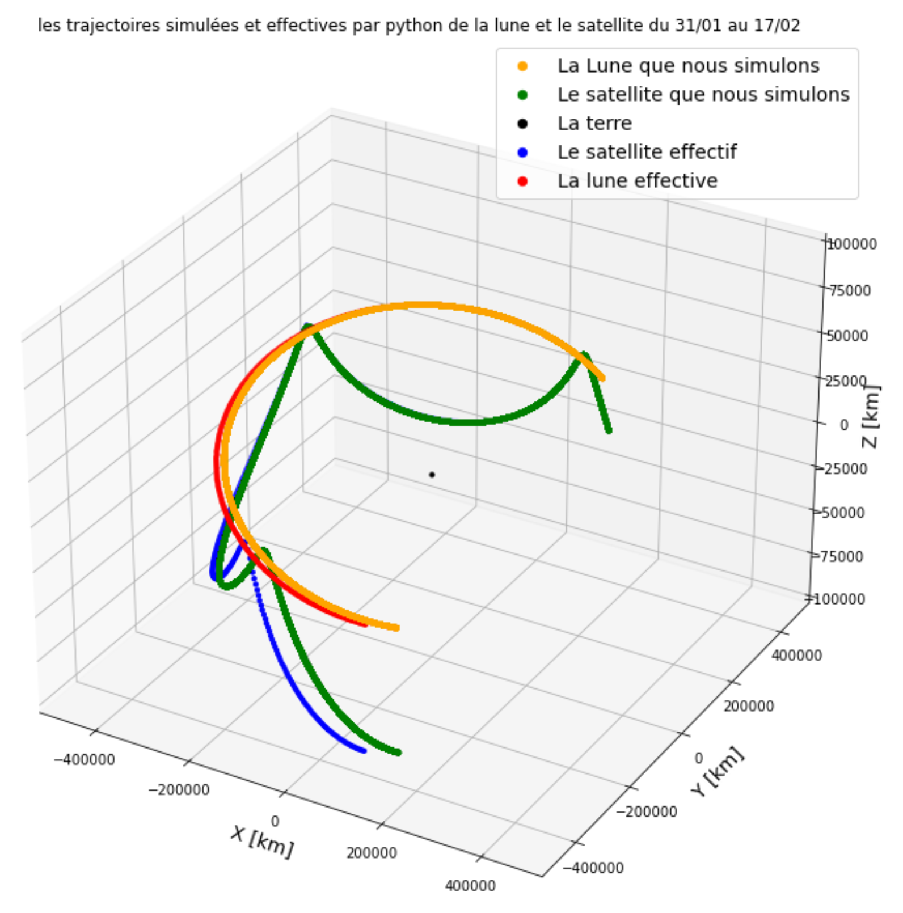

## Some interesting results
Some pictures or animations illustrating my research, created with Python. Enjoy visual mathematics and Physics!

  
  

   <strong>1 : </strong>Visualization results from my L3 internship on <em>collective motion in the presence of predators</em>. 
  The left animation shows the dynamics of a flock of 50 green agents when a single red predator is introduced, 
  while the right one shows the same system with three predators. I mainly focused on the modeling and analysis of such predator–prey interactions with python Code in my report.

  

  <strong>2 : </strong>Result from my L3 physics internship on celestial mechanics.  
  We studied the classical <em>N-body model</em> in astrophysics and plotted the trajectories of the Moon and an Earth-orbiting satellite relative to the Earth.  
  The black dot represents the Earth, the blue curve corresponds to the actual satellite trajectory, and the red curve represents the actual Moon trajectory (real data obtained from NASA).  
  Using the 3-body model, we simulated the green trajectory for the satellite and the yellow trajectory for the Moon.

    

    

        

            <label for="n-input">Size (N)</label>
            <input type="number" id="n-input" value="20" min="5" max="100">
        

        

            <label for="p-input">Prob (p)</label>
            <input type="number" id="p-input" value="0.5" min="0" max="1" step="0.01">
        

        <button class="perc-btn" onclick="window.runPercolationSim()">Run Simulation</button>
    

    
    
Status: Initializing...

     
    <canvas id="percolationCanvas" width="600" height="600"></canvas>

  <strong>3 : </strong>Interactive visualization of <em>Bond Percolation</em> on a 2D square lattice.  
  In this model, <strong>p</strong> represents the probability of a bond (edge) being open. Unlike site percolation, nodes are only colored if they are connected to at least one open bond, preventing isolated colored nodes.  
  Try varying <strong>p</strong> around the critical threshold (0.5) to observe the phase transition in connectivity.




